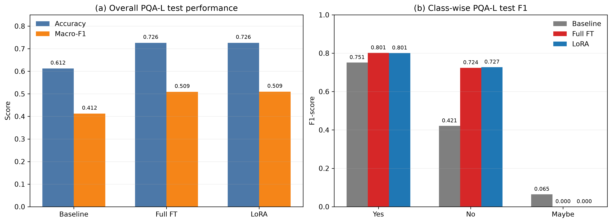
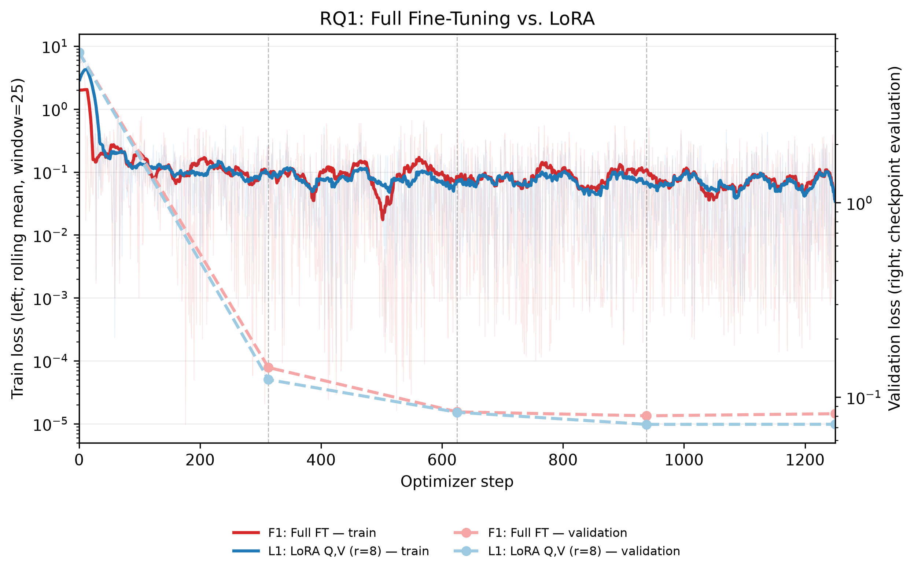
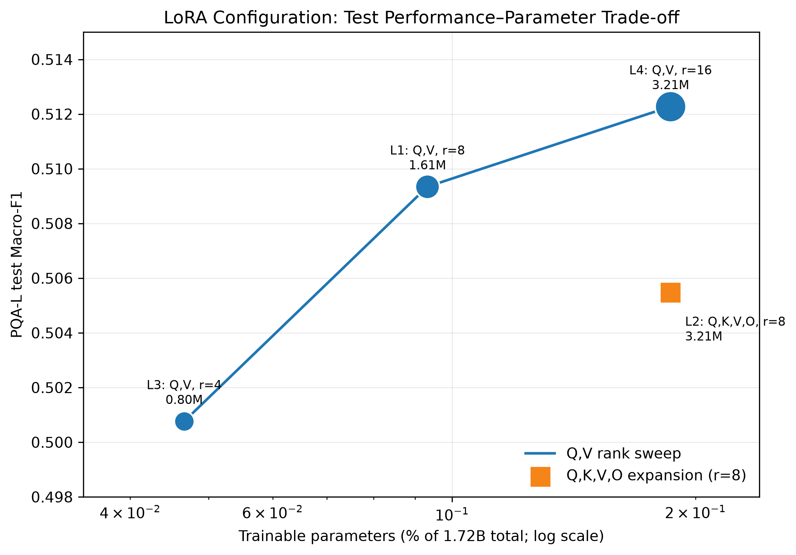
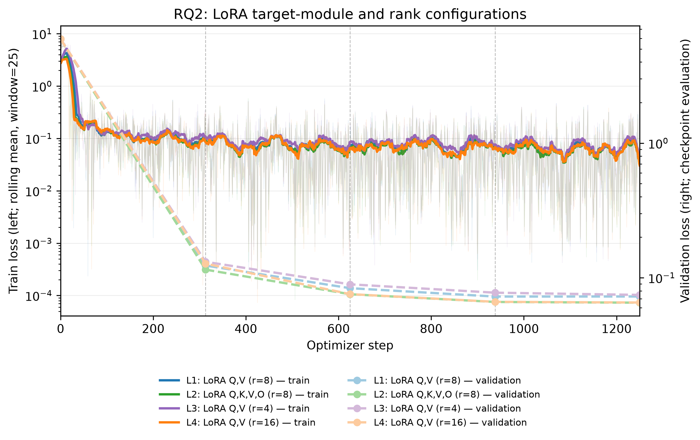
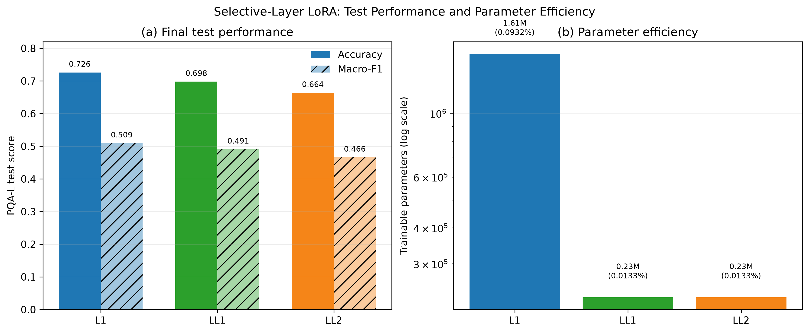
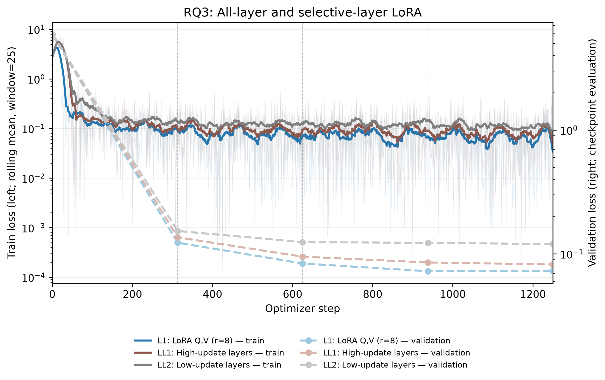
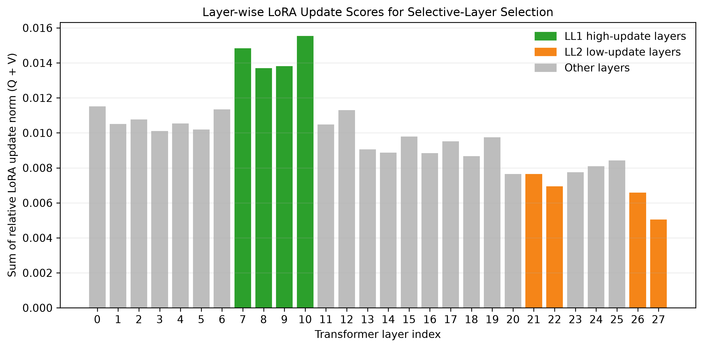
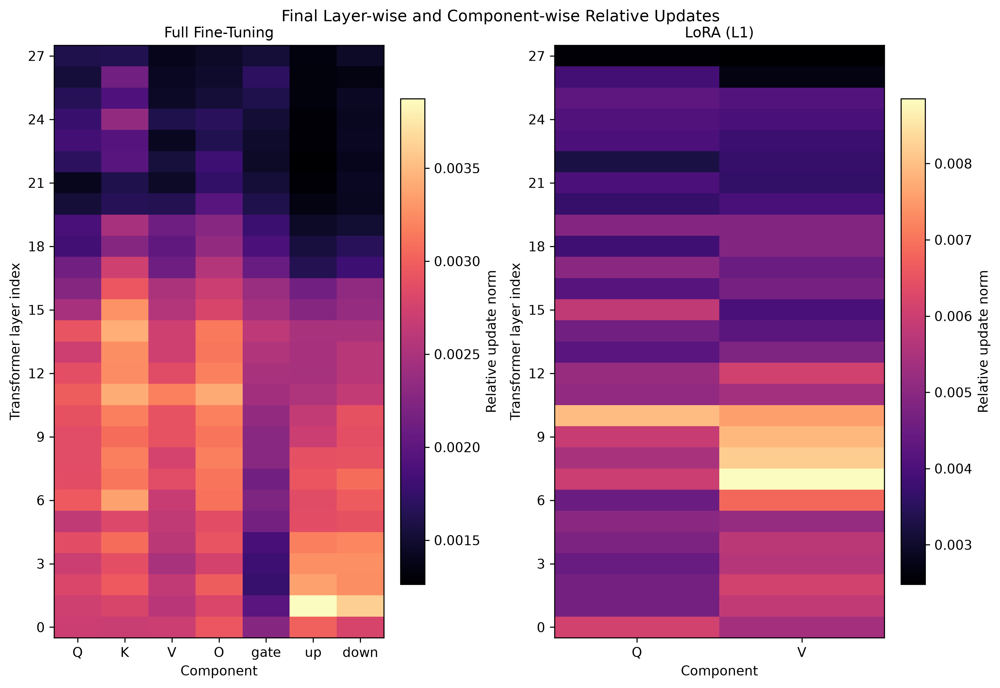

<div align="center">

# Full Fine-Tuning vs. LoRA Analysis

**Performance, efficiency, and layer-wise task adaptation on PubMedQA**


[최종 보고서](.github/reports/PubMedQA%20Fine-Tune%20Report.pdf) ·
[실험 실행 가이드](.github/guides/pubmedqa_full_study.md) ·
[코드 아키텍처](.github/ARCHITECTURE.md)

</div>

## Overview

이 저장소는 PubMedQA에서 Full Fine-Tuning과 LoRA를 동일한 데이터·prompt·평가 파이프라인으로 비교하고, LoRA의 rank, target module, target layer에 따른 task adaptation 차이를 분석합니다. 학습 중 25/50/75/100% checkpoint를 저장하여 성능 변화뿐 아니라 layer별 update와 low-rank structure의 시간적 변화도 추적합니다.

> This is an independent research project and is not affiliated with or endorsed by the
> original PubMedQA authors.

연구 질문은 다음 세 가지입니다.

- **RQ1 — Performance–Efficiency:** LoRA가 Full FT 수준의 성능을 얼마나 적은 parameter, 시간, 저장 공간으로 유지하는가?
- **RQ2 — LoRA Configuration:** rank와 target module이 성능 및 parameter efficiency에 어떤 영향을 주는가?
- **RQ3 — Selective Adaptation:** update가 집중된 layer만 학습해도 all-layer LoRA의 성능을 유지할 수 있는가?

## Key Findings

- PQA-L test에서 Full FT와 대표 LoRA는 모두 **Accuracy 0.726**을 기록했고, Macro-F1은 각각 **0.509 / 0.509**였습니다.
- 대표 LoRA는 Full FT 대비 trainable parameter를 **1.72B → 1.61M**, best checkpoint를 **3.46 GB → 22.3 MB**, 학습 시간을 **3,451.7 s → 2,488.3 s**로 줄였습니다.
- Q,V target에서는 rank가 4 → 8 → 16으로 증가할수록 Test Macro-F1이 **0.501 → 0.509 → 0.512**로 증가했지만, 증가 폭은 점차 작아졌습니다.
- High-update 4개 layer만 사용한 Selective LoRA는 **0.23M trainable parameters**로 all-layer LoRA Macro-F1의 **96.3%** 를 유지했습니다.
- 모든 post-trained model의 `maybe` F1은 0이었습니다. PQA-A train/validation에 `maybe` supervision이 없다는 데이터 구성상의 한계이므로 결과 해석 시 함께 고려해야 합니다.

> README의 최종 성능은 balanced PQA-A validation 값이 아니라, 500개 PQA-L test의 `evaluations/test_summary.json`을 기준으로 합니다.

## Data Collection and Preprocessing

### Collection sources

- Dataset description and paper: [PubMedQA official website](https://pubmedqa.github.io/)
- Upstream code and labeled data: [pubmedqa/pubmedqa](https://github.com/pubmedqa/pubmedqa)
- PQA-A는 Hugging Face의 [`qiaojin/PubMedQA`](https://huggingface.co/datasets/qiaojin/PubMedQA) `pqa_artificial` subset에서 수집합니다.
- PQA-L의 question, abstract context, long answer와 expert label은 공식 PubMedQA 저장소의 [`ori_pqal.json`](https://github.com/pubmedqa/pubmedqa/blob/master/data/ori_pqal.json)을 기본 source로 사용합니다.
- PQA-L test는 공식 [`test_ground_truth.json`](https://github.com/pubmedqa/pubmedqa/blob/master/data/test_ground_truth.json)에 포함된 PMID 500개로 고정한 **test-only** set입니다. 따라서 PQA-L development/CV 데이터는 post-training에 사용하지 않습니다.

`scripts/pubmedqa_data.py prepare`가 세 source를 내려받아 canonical JSON/JSONL로 정규화합니다. 각 row에는 `pubid`, `question`, `context`, `long_answer`, `final_decision`과 함께 `dataset_id`, `dataset_collection`, `source`, `split`, `split_role` provenance를 기록합니다.

### Post-training preprocessing

1. Canonical PQA-A train과 validation을 하나의 sampling pool로 결합합니다.
2. `final_decision`을 기준으로 yes/no class-wise bucket을 구성합니다.
3. `random.Random(42)`로 각 bucket을 독립적으로 shuffle한 뒤, replacement 없이 yes/no를 각각 5,000개씩 train에 할당합니다.
4. 같은 shuffled bucket의 다음 구간에서 yes/no를 각각 1,000개씩 validation에 할당하여 train–validation을 disjoint하게 유지합니다.
5. 각 split 내부 순서를 다시 shuffle하고 JSON과 JSONL을 함께 저장합니다.
6. PQA-L test 500개는 sampling하거나 수정하지 않고 그대로 복사합니다.

최종 split과 `metadata.json`에는 sample 수, label 분포, source path와 `uses_folds: false` 정책이 기록됩니다.

| Split | Source | Yes / No / Maybe | Total | Usage |
|---|---|---:|---:|---|
| Train | PQA-A | 5,000 / 5,000 / 0 | 10,000 | Fine-tuning |
| Validation | PQA-A | 1,000 / 1,000 / 0 | 2,000 | Checkpoint selection |
| Test | PQA-L | 276 / 169 / 55 | 500 | Final evaluation only |

Validation Macro-F1은 존재하는 label인 yes/no의 2-class 기준으로, PQA-L Test Macro-F1은 yes/no/maybe의 3-class 기준으로 계산합니다.

## Method

모든 방법은 동일한 chat prompt와 causal language modeling objective를 사용합니다. Prompt token은 loss에서 masking하고 assistant의 정답 token에 대해서만 gradient를 계산합니다.

```text
System
You are a biomedical question-answering assistant. Answer the question based only on
the provided abstract context.

User
Choose exactly one answer: yes, no, or maybe.

Question:
{question}

Context:
1. {context_1}
...
N. {context_N}

Respond with only one word: yes, no, or maybe.

Assistant
{answer}
```

- **Full FT:** pretrained model의 전체 parameter를 update합니다.
- **LoRA:** base weight는 freeze하고 target linear layer의 low-rank matrices `A`, `B`만 학습합니다. `ΔW = (α/r)BA`를 checkpoint마다 복원해 update norm, singular values, effective rank를 분석합니다.
- **Selective LoRA:** L1의 최종 layer-wise update magnitude를 기준으로 상위/하위 4개 layer를 선택한 뒤 동일한 LoRA configuration을 해당 layer에만 적용합니다.

## Experiment Design

공통 조건은 Qwen3-1.7B, RTX 3090 1장, BF16, 1 epoch, per-device batch 1, gradient accumulation 8, effective batch 8, AdamW, seed 42입니다. Full FT는 learning rate `2e-5`와 gradient checkpointing을 사용하고, LoRA는 learning rate `1e-4`이며 gradient checkpointing을 사용하지 않습니다.

| Run | Method | Target | Rank / Alpha | Layer scope | Purpose |
|---|---|---|---:|---|---|
| B0 | Baseline | — | — | — | Zero-shot reference |
| F1 | Full FT | All parameters | — | All | Full FT reference |
| L1 | LoRA | Q,V | 8 / 16 | All | Representative LoRA |
| L2 | LoRA | Q,K,V,O | 8 / 16 | All | Target-module comparison |
| L3 | LoRA | Q,V | 4 / 8 | All | Rank 4 comparison |
| L4 | LoRA | Q,V | 16 / 32 | All | Rank 16 comparison |
| LL1 | Selective LoRA | Q,V | 8 / 16 | High-update 7,8,9,10 | Layer selection |
| LL2 | Selective LoRA | Q,V | 8 / 16 | Low-update 21,22,26,27 | Position control |

Checkpoint는 1,250 optimizer steps를 기준으로 **313 / 625 / 938 / 1,250 step**에 저장하고 validation합니다. 최종 test checkpoint는 Validation Macro-F1 → Accuracy → Loss 순으로 선택합니다.

## Results

### RQ1. Full FT vs. LoRA



| Metric | Baseline | Full FT (F1) | LoRA (L1) |
|---|---:|---:|---:|
| Test Accuracy | 0.612 | **0.726** | **0.726** |
| Test Macro-F1 | 0.412 | 0.509 | **0.509** |
| Trainable parameters | — | 1.72B (100%) | 1.61M (0.0932%) |
| Training time | — | 3,451.7 s | 2,488.3 s |
| Best checkpoint | — | 3.46 GB | 22.3 MB |
| Peak allocated VRAM | — | 7.94 GB | 8.45 GB |

동일한 test 성능에서 LoRA가 parameter, 학습 시간, 저장 공간을 크게 절감했습니다. Peak VRAM은 Full FT에만 적용된 gradient checkpointing의 영향을 받으므로 LoRA의 구조적 memory 우위로 직접 해석하지 않습니다.

<details>
<summary>RQ1 training / validation loss 보기</summary>



</details>

### RQ2. LoRA Configuration



| Run | Target | Rank | Trainable parameters | Test Acc. | Test Macro-F1 |
|---|---|---:|---:|---:|---:|
| L3 | Q,V | 4 | 0.80M (0.0466%) | 0.714 | 0.501 |
| L1 | Q,V | 8 | 1.61M (0.0932%) | 0.726 | 0.509 |
| L4 | Q,V | 16 | 3.21M (0.1863%) | **0.730** | **0.512** |
| L2 | Q,K,V,O | 8 | 3.21M (0.1863%) | 0.720 | 0.505 |

동일한 3.21M parameter budget에서 Q,V rank 16인 L4가 Q,K,V,O rank 8인 L2보다 높았습니다. 이 실험에서는 adapter 수를 단순히 늘리기보다 adaptation capacity를 어느 module에 배분하는지가 더 중요했습니다.

<details>
<summary>RQ2 training / validation loss 보기</summary>



</details>

### RQ3. Layer-selective LoRA



| Run | Adapted layers | Trainable parameters | Test Acc. | Test Macro-F1 | Macro-F1 retained vs. L1 |
|---|---|---:|---:|---:|---:|
| L1 | All 28 layers | 1.61M (0.0932%) | 0.726 | 0.509 | 100.0% |
| LL1 | High-update: 7,8,9,10 | 0.23M (0.0133%) | 0.698 | 0.491 | **96.3%** |
| LL2 | Low-update: 21,22,26,27 | 0.23M (0.0133%) | 0.664 | 0.466 | 91.5% |

LL1과 LL2는 같은 parameter 수를 사용하지만 high-update layer를 선택한 LL1이 더 높은 성능을 보였습니다. 이는 layer-wise update magnitude가 selective adaptation의 후보 기준으로 활용될 수 있음을 보여줍니다.

<details>
<summary>RQ3 loss와 layer-wise 분석 보기</summary>







</details>

## Architecture

실험 결과와 보고서 산출물을 분리하고, domain → application service → runtime adapter 방향으로 의존하도록 구성했습니다.

```text
src/pubmedqa/
├── domain/       # labels, records, prompts, pure metrics
├── config/       # typed settings and environment parsing
├── data/         # source adapters, split preparation and validation
├── inference/    # evaluation service and Torch/MLX backends
├── training/     # shared engine, checkpoints, validation, strategies
├── experiments/  # data-only run registry, runner factory, orchestration
├── runtime/      # device, distributed lifecycle, artifact I/O
└── reporting/    # typed readers, plot services, report manifest

scripts/          # thin CLI adapters
outputs/          # immutable experiment logs, metrics and model artifacts
reports/          # figures derived from outputs/
.github/          # versioned guides, report and README assets
docs/             # local drafts and internal plans (Git-ignored)
```

기존 import path는 compatibility facade로 유지합니다. 상세한 ownership과 안정성 계약은 [ARCHITECTURE.md](.github/ARCHITECTURE.md)를 참고하세요.

## Quick Start

### 1. Environment

```bash
python -m venv .venv
source .venv/bin/activate
python -m pip install --upgrade pip
python -m pip install -r requirements.txt
python -m pip install -e .
```

Hugging Face에서 gated model을 사용할 경우 `HF_TOKEN`을 설정합니다. Qwen3-1.7B 실행에는 CUDA와 BF16을 지원하는 PyTorch 환경이 필요합니다.

### 2. Prepare Data

```bash
PYTHONPATH=src python scripts/pubmedqa_data.py prepare --clean-output-dir
PYTHONPATH=src python scripts/pubmedqa_data.py describe --strict
PYTHONPATH=src python scripts/pubmedqa_data.py verify-sources
PYTHONPATH=src python scripts/prepare_pubmedqa_posttrain_splits.py
```

`describe --strict`는 dataset source 혼합, path와 `dataset_id` 불일치, PQA-A의 잘못된 `maybe` label을 검사합니다. `verify-sources`는 Hugging Face PQA-L과 공식 GitHub의 `ori_pqal.json` 및 `test_ground_truth.json`을 PMID와 주요 필드 단위로 비교합니다. 마지막 명령은 `data/processed/posttrain_v1/`에 10K balanced train과 2K balanced validation을 Seed 42로 생성합니다. 생성 데이터는 Git에서 제외되며 같은 명령으로 재현합니다.

### 3. Run the Full Study

보고서와 동일한 single-GPU, 1-epoch 설정입니다.

```bash
PUBMEDQA_RUN_ID=study_single_epoch1 \
PUBMEDQA_GPU_IDS=0 \
PUBMEDQA_DISTRIBUTED_MODE=single \
PUBMEDQA_NUM_EPOCHS=1 \
scripts/run_pubmedqa_full_study.sh
```

실행 순서는 `B0 → F1 → L1 → L2 → L3 → L4 → layer selection → LL1 → LL2 → validation`입니다. LL1/LL2 layer는 L1 최종 checkpoint에서 동적으로 선택되므로 별도로 checkpoint 경로를 입력할 필요가 없습니다.

<details>
<summary>DDP / FSDP 실행 예시</summary>

2-GPU DDP에서 global effective batch를 8로 유지하려면 accumulation을 4로 설정합니다.

```bash
PUBMEDQA_GPU_IDS=0,1 \
PUBMEDQA_DISTRIBUTED_MODE=ddp \
PUBMEDQA_NUM_EPOCHS=1 \
PUBMEDQA_GRAD_ACCUM_STEPS=4 \
scripts/run_pubmedqa_full_study.sh
```

FSDP는 먼저 smoke test로 현재 PyTorch/CUDA 조합을 검증합니다.

```bash
bash scripts/run_pubmedqa_fsdp_smoke.sh

PUBMEDQA_GPU_IDS=0,1 \
PUBMEDQA_DISTRIBUTED_MODE=fsdp \
PUBMEDQA_NUM_EPOCHS=1 \
PUBMEDQA_GRAD_ACCUM_STEPS=4 \
scripts/run_pubmedqa_full_study.sh
```

Global effective batch는 `per-device batch × GPU 수 × gradient accumulation`입니다. 따라서 distributed 결과를 single-GPU 결과와 직접 비교할 때 이 값을 동일하게 유지해야 합니다.

</details>

### 4. Regenerate Figures

실험 artifact는 읽기 전용 source로 사용하고, figure는 `reports/` 아래에 생성합니다.

```bash
PYTHONPATH=src python scripts/plot_pubmedqa_rq_learning_curves.py \
  --study-dir outputs/pubmedqa_train/study_single_epoch1_used \
  --output-dir reports/pubmedqa/study_single_epoch1_used/figures/main

PYTHONPATH=src python scripts/plot_pubmedqa_rq1_test_performance.py
PYTHONPATH=src python scripts/plot_pubmedqa_rq2_tradeoff.py
PYTHONPATH=src python scripts/plot_pubmedqa_rq3_selective_performance.py

PYTHONPATH=src python scripts/plot_pubmedqa_appendix_dynamics.py \
  --study-dir outputs/pubmedqa_train/study_single_epoch1_used \
  --output-dir reports/pubmedqa/study_single_epoch1_used/figures/appendix
```

## Outputs

```text
outputs/pubmedqa_train/<run_id>/
├── study_manifest.json
├── study_results.{json,csv}
└── Qwen_Qwen3-1.7B/<condition>/
    ├── config.json
    ├── summary.json
    ├── evaluations/
    ├── analysis/
    ├── logs/
    ├── layerwise_updates/
    └── checkpoints/

reports/pubmedqa/<study_id>/
├── report_manifest.json
└── figures/{main,appendix}/
```

`outputs/`에서는 aggregate metrics와 analysis artifact만 versioning합니다. Dataset의
question/context/label 또는 sample별 prediction을 포함하는 row-level JSONL과 용량이 큰
`checkpoints/`는 Git에서 제외합니다. `reports/`에는 재생성된 PNG/PDF와 provenance
manifest를 저장합니다.

## Validation

```bash
conda run -n AutoAI env PYTHONPATH=src \
  python -m unittest discover -s tests -v

conda run -n AutoAI python -m compileall -q src scripts tests
bash -n scripts/run_pubmedqa_full_study.sh
bash -n scripts/run_pubmedqa_fsdp_smoke.sh
```

GPU 학습 전에는 run registry와 override를 dry-run으로 확인할 수 있습니다.

```bash
PYTHONPATH=src python scripts/run_pubmedqa_experiments.py \
  --dry-run \
  --runs B0,F1,L1,L2,L3,L4,LL1,LL2 \
  --target-layer-override LL1=7,8,9,10 \
  --target-layer-override LL2=21,22,26,27
```

## Documentation

- [Final Report — Full Fine-Tuning vs. LoRA](.github/reports/PubMedQA%20Fine-Tune%20Report.pdf)
- [Code Architecture](.github/ARCHITECTURE.md)
- [Full Study Runner](.github/guides/pubmedqa_full_study.md)
- [Data CLI](.github/guides/pubmedqa_data_cli.md)
- [Prompt and Parser Contract](.github/guides/pubmedqa_prompt_parser.md)
- [Evaluation](.github/guides/pubmedqa_evaluation.md)
- [LoRA Fine-Tuning](.github/guides/pubmedqa_lora_finetune.md)
- [FSDP Troubleshooting](.github/guides/pubmedqa_fsdp_troubleshooting.md)
- [Third-Party Notices](THIRD_PARTY_NOTICES.md)

## Citation

이 저장소의 실험이나 결과를 사용할 때는 원본 PubMedQA 논문을 함께 인용해 주세요.

```bibtex
@inproceedings{jin2019pubmedqa,
  title     = {PubMedQA: A Dataset for Biomedical Research Question Answering},
  author    = {Jin, Qiao and Dhingra, Bhuwan and Liu, Zhengping and
               Cohen, William W. and Lu, Xinghua},
  booktitle = {Proceedings of EMNLP-IJCNLP},
  pages     = {2567--2577},
  year      = {2019},
  url       = {https://aclanthology.org/D19-1259/}
}
```

PubMedQA source와 license attribution은 [THIRD_PARTY_NOTICES.md](THIRD_PARTY_NOTICES.md)에
정리되어 있습니다.

## Scope and Limitations

- 결과는 Qwen3-1.7B, PubMedQA, Seed 42의 단일 실험에 기반하며 seed 반복 실험의 분산을 포함하지 않습니다.
- Train/validation은 PQA-A의 yes/no label만 포함하므로 `maybe` adaptation을 평가하기에 충분하지 않습니다.
- Full FT와 LoRA의 peak VRAM은 gradient checkpointing 조건이 다르므로 직접적인 구조 비교에 한계가 있습니다.
- Layer selection의 다른 model/task 일반화와 catastrophic forgetting 완화 여부는 후속 검증이 필요합니다.
